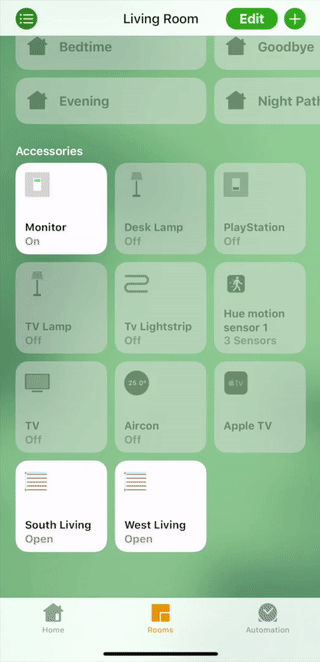
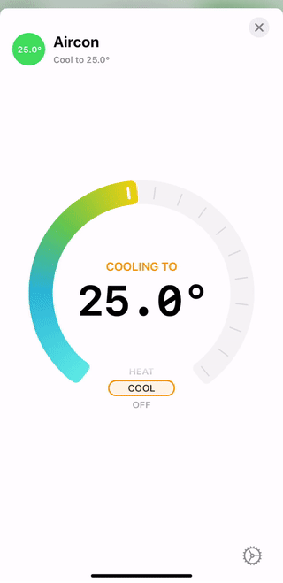

<p align="center">
    
</p>

# Homebridge Daikin Airbase

A Homebridge plugin providing support for the **Daikin Airbase** WiFi module (BRP15B61).

It allows to turn on / off the aircon, set it to cool / heat / auto mode (when supported), change the target temperature and the fan speed.

Daikin devices will be auto-discovered on the network and mapped to individual heater/coolers in the Home app.

<p align="center">
    
    &nbsp;
    
</p>

# Requirements

-   **Node** version 11 or above (verify with `node --version`).
-   **Homebridge** version 0.4.0 or above.

# Installation

1. Install homebridge using:

```sh
npm install -g homebridge
```

2. Install the plugin using:

```sh
npm install -g homebridge-daikin-airbase
```

3. Update your configuration file. See bellow for a sample.

> **Note:** it is also possible to install this plugin in a local `npm` package instead using the homebridge option `--plugin-path`.

# Configuration

## General settings

To configure `homebridge-daikin-airbase`, add the `DaikinAirbase` platform to the `platforms` section of your homebridge's `config.js` file:

```json
{
    "bridge": { "...": "..." },

    "description": "...",

    "platforms": [
        {
            "platform": "DaikinAirbase",
            "name": "My Daikin Airbase Hub"
        }
    ]
}
```

With the above configuration, the platform will perform UDP auto-discovery of the Daikin devices on the local network.

The platform can be configured with the following parameters:

| Parameter  | Type                    | Default | Note                                                                                                                                                                                  |
| ---------- | ----------------------- | ------- | ------------------------------------------------------------------------------------------------------------------------------------------------------------------------------------- |
| `hostname` | String or Array(String) | `null`  | **Optional** - The hostname(s) on your local network of the Daikin Airbase modules (e.g. `192.168.1.10`). Supports a single hostname as `String` or multiple hostnames in an `Array`. |

# Limitation

This plugin does not support setting the aircon into **Dry** or **Fan** mode as these are not supported natively by Homekit (they cannot be mapped to a control in the Home app).

# Contribute

Please feel free to contribute to this plugin by adding support for new device types, implementing new features or fixing bugs. Pull requests are welcome.
