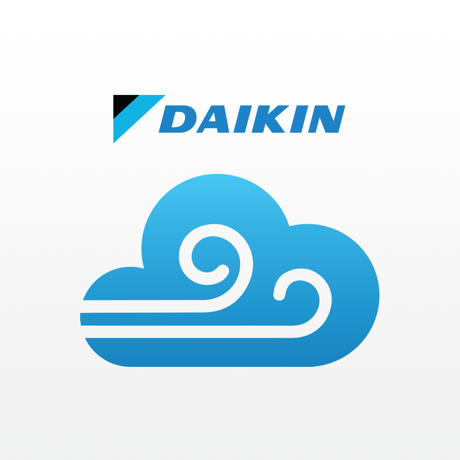

<p align="center">
    
</p>

# Homebridge Daikin Airbase

A Homebridge plugin providing support for the **Daikin Airbase** WiFi module (BRP15B61).

It allows to turn on/off the aircon, set it to cool/heat/fan/dry/auto mode (when supported), change the target temperature and the fan speed.

Daikin devices will be auto-discovered on the network and mapped to individual accessories in the Home app. Each device will be represented by multiple accessories:

-   A **heater/cooler** accessory allowing to set the aircon to cool/heat or auto mode, as well as the threshold temperatures,
-   A **fan** accessory allowing to change the aircon's **fan speed** (low/medium/high) if your device supports changing fan speed,
-   A **switch** allowing to turn on/off **fan mode**,
-   A second **switch** allowing to turn on/off **dry mode** if your device supports that mode.

In addition, if your system includes a **Daikin Zone Controller**, zones will be auto-discovered and mapped to additional switches (one per zone).

# Requirements

-   **Node** version 20 or above (verify with `node --version`).
-   **Homebridge** version 1.0.0 or above (including Homebridge 2.0 beta).

# Installation

1. Install homebridge using:

```sh
npm install -g homebridge
```

2. Install the plugin using:

```sh
npm install -g homebridge-daikin-airbase
```

3. Update your configuration file. See bellow for a sample.

> **Note:** it is also possible to install this plugin in a local `npm` package instead using the homebridge option `--plugin-path`.

# Configuration

## General settings

To configure `homebridge-daikin-airbase`, add the `DaikinAirbase` platform to the `platforms` section of your homebridge's `config.js` file:

```json
{
    "bridge": { "...": "..." },

    "description": "...",

    "platforms": [
        {
            "platform": "DaikinAirbase",
            "name": "Daiking Airbase"
        }
    ]
}
```

With the above configuration, the platform will perform UDP auto-discovery of the Daikin devices on the local network.

The platform can be configured with the following parameters:

| Parameter         | Type                    | Default | Note                                                                                                                                                                                                                                                                                                                                                                               |
| ----------------- | ----------------------- | ------- | ---------------------------------------------------------------------------------------------------------------------------------------------------------------------------------------------------------------------------------------------------------------------------------------------------------------------------------------------------------------------------------- |
| `hostname`        | String or Array(String) | `null`  | **Optional** - The hostname(s) on your local network of the Daikin Airbase modules (e.g. `192.168.1.10`). Supports a single hostname as `String` or multiple hostnames in an `Array`.                                                                                                                                                                                              |
| `pollingInterval` | Number (seconds)        | `300`   | **Optional** - The polling interval for refreshing the platform's accessories state for automations, in seconds. By default set to 300 seconds (5 minutes), it can be set to `0` to disable polling. Note that the information is refreshed on demand when using the Home app, this configuration is only used for background state updates so that automations can react on them. |

# Notes

## Accessory caching

Once the platform has discovered an airbase module on the network, either through auto-discovery or static IP mapping, it will create the associated homekit accessories. These accessories will then be cached by homebridge.

As a safeguard, the platform will never unregister accessories if they cannot be contacted anymore. In consequence, if you are removing an airbase module from your network, you will have to clear the accessory cache of the `homebridge-daikin-airbase` plugin manually to unmap the unused accessories.

Accessories also cache their settings. This means that certain technical properties of your Daikin system will not be reflected on the accessories instantly after they are changed (for instance, Zone Controller names, maximum temperature, number of fan speeds, etc.). Restarting the homebridge server twice will ensure that the accessories use an up to date cache for these values.

# Contribute

Please feel free to contribute to this plugin by adding support for new device types, implementing new features or fixing bugs. Pull requests are welcome.
